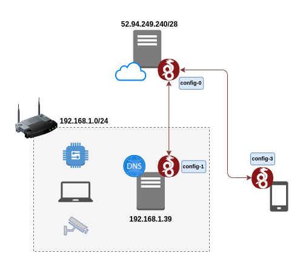

# Wireguard

- [Link](https://www.wireguard.com/)
  

## Setup for home access

The following network configuration allows the secure access to domestic resources through a secure VPN.

If Home Server's DNS resolves names to local services, allows the phone access to private DNS like `*.home`, `*.foo` or whatever you name it.

It relays on public-access server to act as gateway.

> Runs well on an AWS EC2 `t3.nano` instance (2 vCPUs, 0.5 GiB RAM, EBS) for occasional access.

<p align="center">
  
</p>

### `config-0` server

```ini
[interface]
Address = 10.0.0.1/24 # Sets server's ip in the wireguard VPN
ListenPort = 51820
PrivateKey = <REPLACE_ME> # AWS Server's private key

# Home
[Peer]
PublicKey = <REPLACE_ME> # Home Server's public key
AllowedIPs = 10.0.0.2/32, 192.168.1.0/24 # Tells WireGuard to route traffic for these networks to this peer (Home)


# Phone
[Peer]
PublicKey = <REPLACE_ME> # Phone Client's public key
AllowedIPs = 10.0.0.3/32 # Tells WireGuard to route traffic for these networks to this peer (Phone)
```

### `config-1` home

```ini
[Interface]
Address = 10.0.0.2/24 # Sets Home Server's ip in the wireguard VPN
PrivateKey = <REPLACE_ME> # Home Server's private key

[Peer]
PublicKey = <REPLACE_ME>  # AWS Server's public key
Endpoint = <AWS_PUBLIC_IP>:51820 
AllowedIPs = 10.0.0.0/24 # Tells WireGuard to route traffic for these networks to this peer (AWS)
PersistentKeepalive = 25
```

### `config-2` phone client

```ini
[Interface]
Address = 10.0.0.3/24 # Sets Phone Client's ip in the wireguard VPN
PrivateKey = <REPLACE_ME> # Phone Client's private key
DNS = 192.168.1.39  # Home DNS server

[Peer]
PublicKey = <REPLACE_ME>  # AWS Server's public key
Endpoint = <AWS_PUBLIC_IP>:51820
AllowedIPs = 10.0.0.0/24, 192.168.1.0/24 # Tells WireGuard to route traffic for these networks to this peer (AWS)
PersistentKeepalive = 25
```
